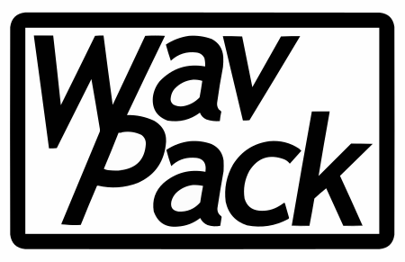

Custom WavPack Build
--------------------

WavPack is a free, lossless audio codec. While not as widely used as FLAC,
it was the advantage of being able to store floating point audio samples.
Movie audio, CDs and HD music sold online are generally 16-bit or 24-bit
integer quantized (which is lossless as FLAC), but for audio production,
floating point audio is used and WavPack is the only viable option since
plain `.wav` files quickly hit their 2 GiB size limit at surround streams.

libwavpack is a C/C++ library that contains the reference encoder and
decoder for the format.

What's in this repository?
--------------------------

This `CMakeLists.txt` is a custom build that *blindly* assumes a modern
desktop Linux build environment / Windows Visual Studio environment
and skips all configure checks.

You should prefer the `CMakeLists.txt` that ships with libwavpack.

This one exists specifically for some of my "Nuclex" projects, where
I'm being pedantic about compiler settings. The `CMakeLists.txt` in this
repository takes all C/C++ compiler options from an external CMake include
file (`../../build-system/cmake/cplusplus.cmake`), thus making sure that
all libraries involved in my tools are compiled with the exact same compiler
settings and that i.e. PGO can be used from end to end.
